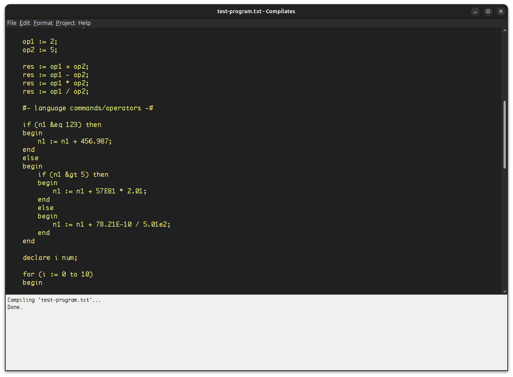

# Compilates

> [!NOTE]
> Software created for academic purposes only.

**Compilates** is a lexical and syntactical analyzer written in Java 6.

Project developed as part of the conclusion of the Bachelor's course in Computer Science at [**UNISAL**](https://unisal.br) in 2008.

It does not actually compile files, but rather runs lexical and syntactic analysis on a pre-defined pseudo-language. Unfortunately most of the documentation related to this project was lost.

This repo was created in order to keep at least the codebase alive for reference.

## Java Swing interface

This is how the user interface looks like.

## Credits and license

Alexandre Bolzon, 2008 
[MIT License](./LICENSE)
